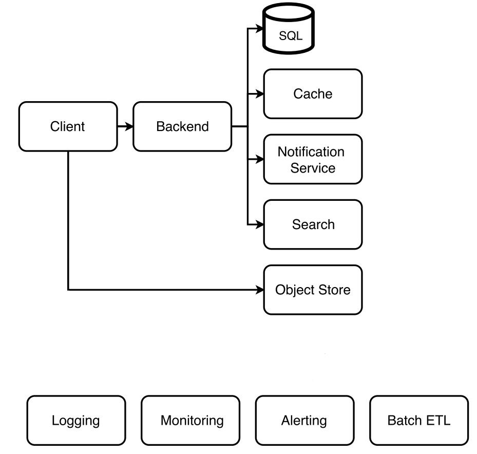
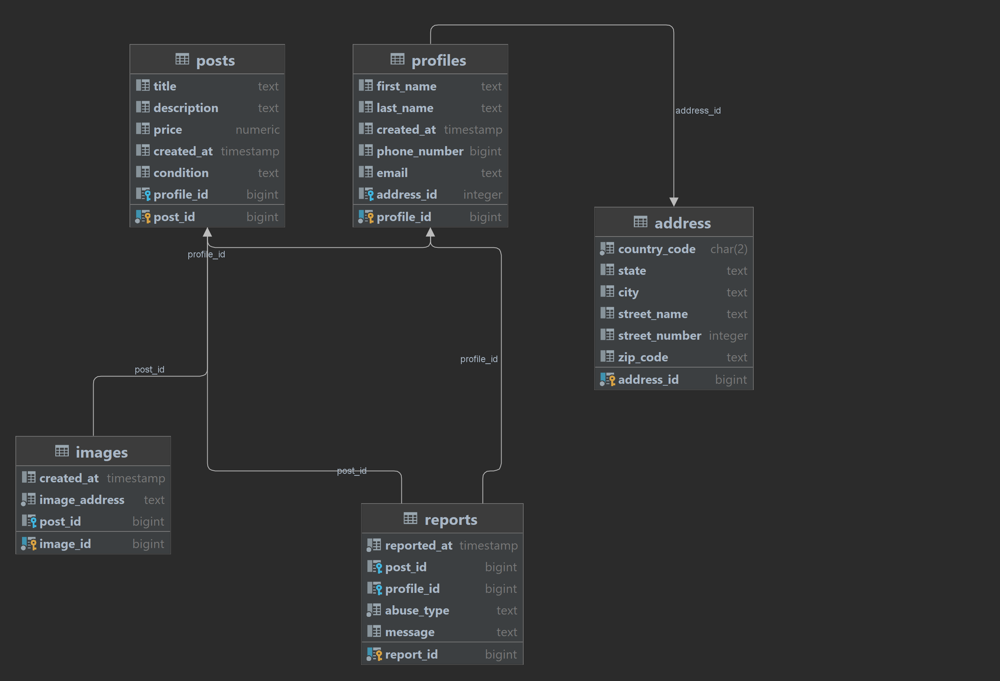

# TopUch


## Diagram


## Technologies Used
- Java 26
- Spring Boot
- PostgreSQL
- Amazon S3
- Redis
- Elasticsearch
- Spring Data JPA
- Liquibase
- MapStruct
- Kafka
- Spring MailSender (SMTP)
- Telegram Bot API
- Keycloak
- Spring Security
- Jakarta Validation API
- Prometheus
- Grafana
- Swagger API Documentation


## Sequence diagram


## Class diagram


## API Documentation

## Database migrations

Liquibase owns the PostgreSQL schema and runs automatically during application
startup. Hibernate only validates the resulting schema.

Set the required database password before starting locally:

```bash
export DB_PASSWORD='your-local-password'
./mvnw spring-boot:run
```

The changelog starts at `src/main/resources/db/changelog/db.changelog-master.yaml`.
Migration conventions and deployment rules are documented in
`src/main/resources/db/changelog/README.md`.

### Auth Controller
- **POST** `/api/v1/registration`: Register a new user.
- **POST** `/api/v1/authorization`: Authorize a user.

### Profile Controller
- **GET** `/api/v1/profile/{id}`: Retrieve a user profile by ID.
- **PUT** `/api/v1/profile/{id}`: Update a user profile.
- **GET** `/api/v1/profile`: Retrieve all user profiles (Admin Only).

### Post Controller
- **GET** `/api/`: Retrieve a post by ID.
- **PUT** `/api/{id}`: Update a post (Admin Only).
- **DELETE** `/api/`: Delete a post by ID (Admin Only).
- **GET** `/api/`: Retrieve all posts.
- **POST** `/api/`: Create a new movie (Admin Only).

### PostSearch Controller
- **GET** `/api/`: .
- **POST** `/api/`: .
- **GET** `/api/`: Retrieve a Post by ID.
- **DELETE** `/api/`: Delete a Post by ID.

### Report Controller
- **GET** `/api/`: Retrieve all report.
- **POST** `/api/`: Create a new report (Admin Only).
- **DELETE** `/api/`: Delete a report by ID (Admin Only).
- **GET** `/api/`: Retrieve a report by ID.

# Security
- The API is secured using JSON Web Tokens (JWT) handled by Auth0. To access the API, you will need to obtain a JWT by authenticating with the /login endpoint. The JWT should then be passed in the Authorize option available in the Swagger-ui.
